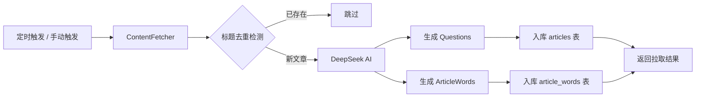

## 用户需求

解决当前文章数量不足的问题，通过集成多个外部英文内容源实现每日文章自动更新。

## 产品概述

构建一套 **外部内容自动采集 + AI 智能加工 + 定时/手动双模发布** 的文章供给管线，确保平台每天都有新鲜、分级适配的英文阅读文章。

## 核心功能

- **多源内容采集**：从 NewsAPI、Simple English Wikipedia、Project Gutenberg、Breaking News English 等多个来源按年级拉取英文文章
- **AI 智能加工**：通过 DeepSeek API 为每篇新文章自动生成 4 道阅读理解题（含选项和解析）+ 5 个生词标注（含音标和中文释义）
- **定时自动更新**：每天早上 8 点自动执行，每个年级约 20 篇，4 个年级共约 80 篇
- **手动即时触发**：前端管理后台页面提供一键触发按钮，支持实时拉取
- **标题去重保护**：入库前按标题查重，避免重复内容
- **拉取状态反馈**：前端页面显示最近拉取结果（成功/失败篇数、耗时等）

## 技术栈

- 后端框架：Express + TypeScript（复用现有）
- 数据库：SQLite via node:sqlite（复用现有）
- 定时任务：node-cron
- AI 调用：openai SDK（兼容 DeepSeek API）
- HTTP 抓取：axios（前端已有）+ cheerio + rss-parser
- 前端：React 18 + TypeScript + Ant Design 5 + React Router 6（复用现有）

## 实现方案

### 整体架构：Pipeline 模式

采用 **采集 → 去重 → AI 加工 → 入库** 的四阶段管线架构，每个阶段独立可替换：



### 关键设计决策

1. **Pipeline 模式而非单方法**：每个阶段（采集、去重、AI、入库）独立成函数，便于单独测试、替换和复用
2. **多 Source Fetcher 架构**：每个内容源实现统一接口 `ContentFetcher`，按年级返回 `RawArticle[]`，便于新增/移除来源
3. **年级匹配策略**：Breaking News English 天然按 level 分级直接映射；NewsAPI/Wikipedia/Gutenberg 按内容长度和复杂度自动推算
4. **AI 批量调用**：不是逐篇调用 DeepSeek，而是每 5 篇合并为一次请求（batch prompt），减少 API 调用次数和费用
5. **事务保护**：每篇文章的 articles + article_words 插入在同一事务中，确保数据一致性
6. **容错与降级**：某个源拉取失败不影响其他源；AI 调用失败则文章仍可入库（无 questions/article_words），标记为非完整状态

## 实现细节

### 性能考虑

- **批量 AI 调用**：每 5 篇文章合并为一个 DeepSeek prompt，80 篇只需 ~16 次 API 调用（而非 80 次），大幅降低延迟和费用
- **并发源拉取**：多个内容源使用 `Promise.allSettled` 并发请求，即使部分源失败也不阻塞整体流程
- **事务批量写入**：使用 `BEGIN TRANSACTION` + `COMMIT`，80 篇文章一次性提交，避免逐条提交的磁盘 I/O 开销
- **内存控制**：拉取到文章后先存数组，分批（每批 5 篇）调用 AI + 入库，避免一次性加载所有文章到内存

### 日志规范

- 复用现有 Winston logger，级别映射：拉取开始/结束用 `info`，单篇入库用 `debug`，源拉取失败用 `warn`，AI 调用失败用 `error`
- 日志内容避免输出完整文章内容，仅记录标题和长度
- 拉取结束输出汇总：`[Fetch] 完成：源A 8篇，源B 12篇，共入库 18篇，跳过 2篇(重复)，失败 0篇`

### 兼容性

- 新增 `insertArticle` 方法到 `IArticleRepository` 接口，但保留现有方法不变
- 新增 `/api/admin/fetch-articles` 路由，不影响现有 `/api/articles/*` 路由
- 如果 `DEEPSEEK_API_KEY` 未配置，拉取管线跳过 AI 加工阶段，文章不含 questions/article_words 仍可入库
- node-cron 通过 `CRON_ENABLED` 环境变量控制开关，默认关闭（dev 环境不自动执行）

## 架构设计

### 系统模块划分

```
┌──────────────────────────────────────────────────────────┐
│                    后端 Backend                           │
├──────────────────────────────────────────────────────────┤
│  src/scheduler.ts          ← node-cron 定时调度入口      │
│  src/services/                                              │
│    ├── articleImportService.ts  ← Pipeline 编排层        │
│    ├── deepseekService.ts       ← DeepSeek API 调用      │
│    └── content-fetchers/                                   │
│         ├── types.ts            ← ContentFetcher 接口    │
│         ├── breaking-news.ts    ← Breaking News English  │
│         ├── newsapi.ts          ← NewsAPI 新闻           │
│         ├── wikipedia.ts        ← Simple Wikipedia       │
│         └── gutenberg.ts        ← Project Gutenberg      │
│  src/routes/admin.ts         ← POST /api/admin/fetch     │
│  src/repositories/                                              │
│    ├── interfaces/IArticleRepository.ts  ← +insertArticle│
│    └── sqlite/SqliteArticleRepository.ts ← +实现         │
│  src/config/index.ts         ← +DEEPSEEK_API_KEY 等     │
│  src/index.ts                ← +挂载 cron 和 admin 路由 │
├──────────────────────────────────────────────────────────┤
│                    前端 Frontend                          │
│  src/pages/Admin.tsx         ← 管理后台页面              │
│  src/router/index.tsx        ← +/admin 路由              │
│  src/components/Layout.tsx   ← +导航入口(可选)           │
└──────────────────────────────────────────────────────────┘
```

### 数据流

```
定时器 8:00 / Admin 页面点击
        │
        ▼
articleImportService.runPipeline()
        │
        ├──► [并发] breaking-news.fetchAll(level)  ──┐
        ├──► [并发] newsapi.fetchAll(level)         ──┤
        ├──► [并发] wikipedia.fetchAll(level)       ──┤──► RawArticle[]
        ├──► [并发] gutenberg.fetchAll(level)       ──┘   (批量汇总)
        │
        ▼
    去重检测（SQL: SELECT id FROM articles WHERE title = ?）
        │
        ▼ (每 5 篇一批)
    deepseekService.enrich(batch) → { questions, articleWords }
        │
        ▼
    repo.insertArticle(article, words) → SQLite
        │
        ▼
    返回 FetchResult { fetched, inserted, skipped, failed, errors[] }
```

## 目录结构

```
english-read/
├── .env                              # [MODIFY] 新增 DEEPSEEK_API_KEY, NEWSAPI_KEY, CRON_ENABLED 等环境变量
├── .env.example                      # [MODIFY] 同步新增环境变量模板
├── packages/
│   └── backend/
│       ├── package.json              # [MODIFY] 新增依赖 node-cron, openai, cheerio, rss-parser
│       └── src/
│           ├── index.ts              # [MODIFY] 挂载 cron 调度器 + admin 路由
│           ├── config/
│           │   └── index.ts          # [MODIFY] 新增 deepseekApiKey, newsApiKey, cronEnabled 等配置项
│           ├── scheduler.ts          # [NEW] node-cron 定时任务入口，每天 8:00 触发 articleImportService.runPipeline()
│           ├── routes/
│           │   └── admin.ts          # [NEW] POST /api/admin/fetch-articles，调用 articleImportService，返回拉取结果
│           ├── services/
│           │   ├── articleImportService.ts  # [NEW] Pipeline 编排层：协调采集→去重→AI→入库全流程，返回 FetchResult
│           │   ├── deepseekService.ts       # [NEW] DeepSeek API 封装：批量生成 questions + article_words
│           │   └── content-fetchers/
│           │       ├── types.ts             # [NEW] ContentFetcher 接口 + RawArticle 类型定义
│           │       ├── breaking-news.ts     # [NEW] Breaking News English 抓取器，解析 RSS → 按 level 分类
│           │       ├── newsapi.ts           # [NEW] NewsAPI 抓取器，按关键词 + 语言=en 获取新闻
│           │       ├── wikipedia.ts         # [NEW] Simple Wikipedia 抓取器，随机获取百科短文
│           │       └── gutenberg.ts         # [NEW] Project Gutenberg 抓取器，获取短篇故事/章节
│           └── repositories/
│               ├── interfaces/
│               │   └── IArticleRepository.ts    # [MODIFY] 新增 insertArticle、checkTitleExists 方法签名
│               └── sqlite/
│                   └── SqliteArticleRepository.ts  # [MODIFY] 实现 insertArticle、checkTitleExists
│   └── frontend/
│       └── src/
│           ├── router/
│           │   └── index.tsx              # [MODIFY] 新增 /admin 路由指向 Admin 页面
│           └── pages/
│               └── Admin.tsx              # [NEW] 管理后台页面：触发按钮 + 拉取状态展示 + 拉取历史记录
```

## 关键代码结构

### ContentFetcher 接口

```typescript
// packages/backend/src/services/content-fetchers/types.ts
export interface RawArticle {
  title: string;
  content: string;
  summary: string;
  level: string; // primary | junior | senior | college
  category: string; // story | news
  sourceName: string; // 来源标识，用于日志
}

export interface ContentFetcher {
  /** 抓取器名称 */
  readonly name: string;
  /** 获取指定年级的文章列表 */
  fetch(level: string, count: number): Promise<RawArticle[]>;
}
```

### IArticleRepository 新增方法

```typescript
// 在 IArticleRepository 接口中新增：
/** 检查标题是否已存在（去重） */
checkTitleExists(title: string): Promise<boolean>;
/** 插入文章及其生词标注（事务保护） */
insertArticle(
  title: string, content: string, summary: string,
  level: string, category: string, questions: Question[],
  words: { word: string; translation: string; phonetic: string }[]
): Promise<{ articleId: number }>;
```

### DeepSeekService 核心方法

```typescript
// packages/backend/src/services/deepseekService.ts
export class DeepSeekService {
  /**
   * 批量加工文章：为每篇文章生成 questions 和 article_words
   * @param articles 原始文章数组（每批最多 5 篇）
   * @returns 加工后的文章数组，含 questions + words
   */
  async enrichBatch(articles: RawArticle[]): Promise<EnrichedArticle[]>;
}

export interface EnrichedArticle extends RawArticle {
  questions: Question[]; // 4 道阅读理解题
  articleWords: ArticleWordInput[]; // 5 个生词
}
```

## Agent Extensions

### Skill

- **writing-plans**
- 用途：在编码前进行任务拆解和步骤规划，确保实现方案覆盖所有细节
- 预期结果：产出完整的开发计划，明确每个文件的修改内容和实现顺序

- **brainstorming**
- 用途：在实现内容抓取器和 AI prompt 设计阶段，探索最佳的 prompt 模板和抓取策略
- 预期结果：产出经过验证的 DeepSeek prompt 模板和各内容源的抓取策略方案
