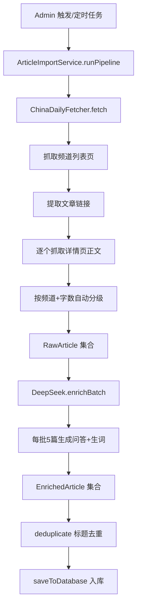

## 用户需求

采用"真实文章爬取 + AI 生成问答/生词"模式，不使用 AI 直接生成文章内容（质量不好把控）。

## 产品概述

重新启用文章抓取管线：从 **China Daily**（国内直连、纯 HTML SSR）爬取真实英文文章，然后由 **DeepSeek AI** 为每篇文章自动生成 4 道阅读理解题和 5 个核心生词标注。

## 核心功能

- 从 China Daily 多个频道（/world/、/life/、/china/、/business/ 等）抓取英文文章列表和正文
- 按频道类型 + 文章字数自动将文章分为四个年级（primary/junior/senior/college）
- DeepSeek AI 仅负责加工：为已抓取的文章生成阅读题和生词
- 标题去重防重复入库
- Admin 页面可手动触发拉取，定时任务保持每天 8:00 自动执行

## Tech Stack

- 爬虫：cheerio + axios（均已安装，cheerio @^1.2.0，axios @^1.18.1）
- AI 加工：DeepSeek API（openai SDK）
- 后端框架：Express + TypeScript
- 数据库：SQLite（node:sqlite）

## Implementation Approach

### 核心策略

新增 `ChinaDailyFetcher` 实现 `ContentFetcher` 接口，作为唯一数据源；`DeepSeekService` 保留 `enrichBatch()` 移除 `generateArticles()`；`ArticleImportService` pipeline 改为：爬取列表页 → 抓取详情页正文 → DeepSeek 加工问答 → 去重 → 入库。

### 难度自动分级逻辑

China Daily 无难度标注，通过两步策略自动分级：

1. **频道基础映射**：`/life/`、`/culture/`、`/entertainment/` → junior 基线；`/world/`、`/china/` → senior 基线；`/business/`、`/tech/`、`/opinion/` → college 基线
2. **字数修正**：正文 < 200 词 → 降一级（最低 primary）；> 800 词 → 升一级（最高 college）
3. 限制 primary 仅从 life/culture 产生，避免新闻类进入低年级

### 爬取策略

- 先请求频道列表页（如 `/world/`），用 cheerio 提取所有 `a[href*="/a/"]` 链接
- 对每个链接请求详情页，提取 `<div class="article-content">` 或正文容器的纯文本
- 每个请求间隔 1-2 秒（随机延迟），防止被 ban
- 单页请求超时 15 秒

### 性能考量

- 每个年级目标 20 篇，需爬取约 100-120 篇详情页（部分会被长度/难度过滤）
- 按 1.5 秒间隔估算，爬取阶段约 2.5-3 分钟
- DeepSeek 加工 80 篇（每 5 篇一批，共 16 批），约 3-5 分钟
- 总管线预计 5-8 分钟，前端超时已设为 300 秒

## Architecture Design



## Directory Structure

```
packages/backend/src/services/
├── content-fetchers/
│   ├── types.ts              # [不变] ContentFetcher 接口和 RawArticle 类型
│   ├── chinadaily.ts         # [NEW] China Daily 爬虫。实现 ContentFetcher。
│   │                         #   - 列表页抓取：axios GET → cheerio 提取 a[href*="/a/"]
│   │                         #   - 详情页抓取：正文提取 + 难度自动分级
│   │                         #   - 分级策略：频道映射 + 字数修正
│   │                         #   - 礼貌间隔：1-2s 随机延迟
│   ├── breaking-news.ts      # [MODIFY] 标记 @deprecated，保留代码但不再使用
│   ├── gutenberg.ts          # [MODIFY] 同上
│   ├── newsapi.ts            # [MODIFY] 同上
│   └── wikipedia.ts          # [MODIFY] 同上
├── deepseekService.ts        # [MODIFY] 移除 generateArticles()、generateBatch()、
│                             #   GENERATE_SYSTEM_PROMPT、LEVEL_REQUIREMENTS、
│                             #   GENERATE_BATCH_SIZE、GeneratedArticle 接口。
│                             #   保留 enrichBatch()、processBatch()、SYSTEM_PROMPT
├── articleImportService.ts   # [MODIFY] Pipeline 重写：
│                             #   fetchFromChinaDaily() 替代 generateAll()
│                             #   保留 deduplicate() 和 saveToDatabase()

packages/frontend/src/
└── pages/
    └── Admin.tsx             # [MODIFY] 使用说明文案更新为 China Daily 来源
```

## Key Code Structures

### ChinaDailyFetcher 核心接口

```typescript
// 频道 → 基础难度映射
const CHANNEL_LEVEL_MAP: Record<string, string> = {
  "/life/": "junior",
  "/culture/": "junior",
  "/entertainment/": "junior",
  "/world/": "senior",
  "/china/": "senior",
  "/business/": "college",
  "/tech/": "college",
  "/opinion/": "college",
};

// 爬取频道列表及其目标数量分配
const CHANNEL_CONFIGS: { path: string; primaryCount: number }[] = [
  { path: "/world/", primaryCount: 12 },
  { path: "/life/", primaryCount: 8 },
  { path: "/china/", primaryCount: 8 },
  { path: "/business/", primaryCount: 4 },
];
```

### Pipeline 核心流程

```typescript
// ArticleImportService 新流程
async runPipeline(): Promise<FetchResult> {
  // 阶段1：China Daily 爬取 → RawArticle[]
  const rawArticles = await this.fetchFromChinaDaily(result);
  // 阶段2：DeepSeek 加工 → EnrichedArticle[]
  const enriched = await this.deepseek.enrichBatch(rawArticles);
  // 阶段3：去重
  const newArticles = await this.deduplicate(enriched, result);
  // 阶段4：入库
  await this.saveToDatabase(newArticles, result);
}
```

## Agent Extensions

### SubAgent

- **code-explorer**
- Purpose: 在实现过程中搜索跨文件的引用关系，确认 `generateArticles` 的所有调用点，确保移除时无遗漏
- Expected outcome: 定位到所有引用 generateArticles 的文件和行号，确保清理完整
