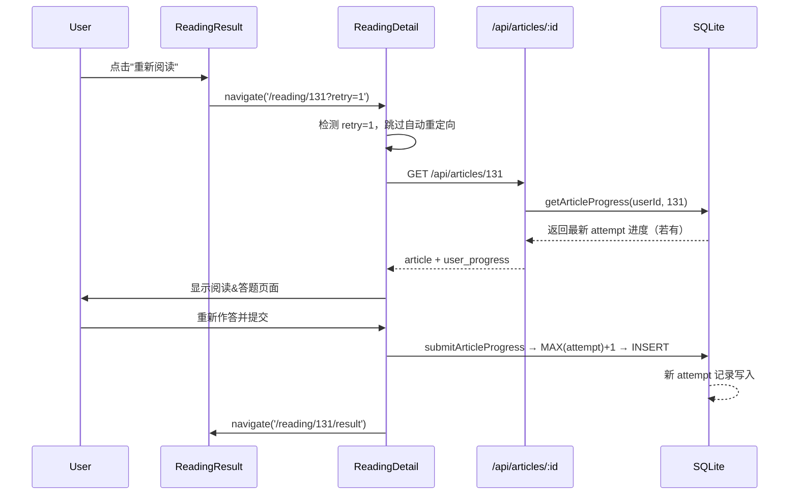

## 用户需求

阅读结果页（`/reading/:id/result`）的"重新阅读"按钮点击后需跳转回阅读答题页面，让用户可以重新作答。同时，用户同一篇文章的历史答题记录需要保留（每次"重新阅读"视为新的一轮 attempt），不删除旧数据。

## 核心功能

- **多轮答题（attempt）机制**：`user_article_progress` 表新增 `attempt` 字段，同一用户对同一文章可有多条进度记录，每次"重新阅读"追加一条新记录
- **后端获取最新进度**：`getArticleProgress` 始终返回最新一轮（attempt 最大）的答题结果
- **前端绕过自动重定向**：`ReadingDetail` 检测 URL 中的 `?retry=1` 参数时，跳过"已有进度→自动跳到结果页"的逻辑
- **统计查询适配**：`total_articles_read` 按 `DISTINCT article_id` 计数（不因多轮重复计数），`recent_articles` 按文章去重取最新时间

## 技术栈

- 后端：Express + TypeScript + SQLite（`node:sqlite` 内置模块）
- 前端：React 18 + TypeScript + React Router v6 + React Query
- 数据库迁移：编号 SQL 脚本（`migrations/` 目录，`runMigrations` 自动执行）

## 实现方案

### 核心思路

引入 `attempt`（轮次）字段，使同一用户对同一文章可保留多条进度记录。`getArticleProgress` 自动返回最新一轮；stats 类查询做去重处理避免重复计数。前端通过 `?retry=1` URL 参数控制 ReadingDetail 是否跳过自动重定向。

### 数据库模型变更

```
-- 旧
user_article_progress (id, user_id, article_id, answers, completed_at)
UNIQUE(user_id, article_id)

-- 新
user_article_progress (id, user_id, article_id, attempt INT DEFAULT 1, answers, completed_at)
UNIQUE(user_id, article_id, attempt)
```

### 数据流



### 影响范围分析

| 文件                             | 改动类型 | 说明                                                         |
| -------------------------------- | -------- | ------------------------------------------------------------ |
| `schema.sql`                     | 修改     | 新增 attempt 列 + 改 UNIQUE 约束                             |
| `migrations/005_add_attempt.sql` | 新建     | 迁移脚本，为已有数据设 attempt=1                             |
| `SqliteProgressRepository.ts`    | 修改     | submitArticleProgress、getArticleProgress、stats/recent 查询 |
| `IProgressRepository.ts`         | 不变     | 接口签名无需改动                                             |
| `ReadingDetail.tsx`              | 修改     | useEffect 加 retry 参数判断                                  |
| `ReadingResult.tsx`              | 修改     | 按钮导航加 `?retry=1`                                        |

### 关键决策

1. **为何不改接口签名**：`getArticleProgress(userId, articleId)` 返回最新 attempt 语义不变；`submitArticleProgress` 内部从 upsert 改为查询 MAX(attempt)+INSERT，调用方无感
2. **stats 去重策略**：`total_articles_read` 用 `COUNT(DISTINCT article_id)` 去重；`avg_quiz_score` 只取每篇文章最新 attempt 的平均（反映当前水平）；`recent_articles` 用 `GROUP BY article_id` + `MAX(completed_at)` 去重；`weekly_study_minutes` 文章计数也改为 `COUNT(DISTINCT article_id)` 去重<br/>注：答题结果页显示的始终是当前 attempt 的得分，不受 stats 聚合策略影响
3. **SQLite 不支持 ALTER COLUMN / DROP CONSTRAINT**，迁移需重建表（参考已有 `002_add_article_progress_unique.sql` 范式）

## 目录结构

```
packages/backend/src/
├── db/
│   ├── schema.sql                              # [MODIFY] 新增 attempt INT DEFAULT 1，UNIQUE 改为 (user_id, article_id, attempt)
│   └── migrations/
│       └── 005_add_attempt_to_article_progress.sql  # [NEW] 重建表加 attempt 列，已有数据 attempt=1
├── repositories/
│   ├── interfaces/
│   │   └── IProgressRepository.ts              # [不变] 接口签名无需改动
│   └── sqlite/
│       └── SqliteProgressRepository.ts          # [MODIFY] submitArticleProgress 改为 INSERT 新模式；getArticleProgress 按 attempt DESC；stats 查询去重
└── routes/
    ├── articles.ts                              # [不变] GET /:id 调用 getArticleProgress 自动拿到最新
    └── admin.ts                                 # [不变] DELETE 语句不受影响

packages/frontend/src/
└── pages/
    ├── ReadingDetail.tsx                         # [MODIFY] 读取 searchParams 中的 retry 参数，跳过自动重定向
    └── ReadingResult.tsx                         # [MODIFY] "重新阅读"按钮 navigate 到 /reading/:id?retry=1
```

## Agent Extensions

### Skill

- **writing-plans**
- Purpose：在开始编码前，针对多步骤变更（数据库迁移 + 后端 Repository + 前端两个页面）生成详细执行计划
- Expected outcome：产出分步实施清单，确保迁移、后端、前端变更顺序正确且可回滚

- **systematic-debugging**
- Purpose：修改完成后验证"重新阅读"按钮的完整链路是否生效，排查潜在边界问题（如首次阅读无 attempt、多次重试后的 stats 计数等）
- Expected outcome：确认按钮不再陷入死循环，答题历史正确保留，统计数字合理
