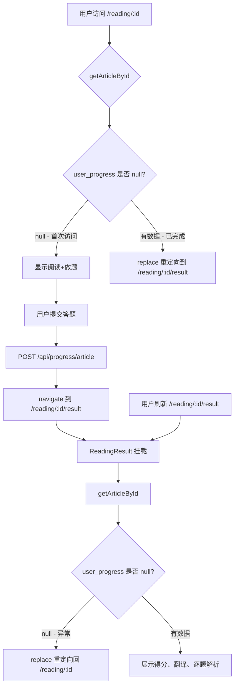

## 用户需求

修复 ReadingDetail 组件的状态持久化缺陷：当前阅读做题和答案解析共用同一个路由和组件，通过 `useState`（`submitted`、`quizResult`）控制视图切换。用户提交答题进入答案解析阶段后，如果刷新浏览器，所有 local state 丢失，`submitted` 回到 `false`，用户看到的又是阅读做题视图，无法查看已提交的答题结果。

## 解决方案

采用路由拆分方案：将两个阶段拆分为独立路由，URL 本身标识当前阶段。提交后跳转到结果路由，刷新后直接从后端已有数据恢复。

## 核心功能

- **路由拆分**：`/reading/:id`（阅读+做题）和 `/reading/:id/result`（答案解析）
- **自动跳转**：已完成的用户进入 `/reading/:id` 时自动跳转到结果页
- **刷新恢复**：刷新 `/reading/:id/result` 时从后端 `user_progress` 恢复结果，无需重新提交
- **防护重定向**：未提交用户直接访问 `/reading/:id/result` 时自动跳回阅读页

## 技术方案

### 后端变更：GET /api/articles/:id 返回 quiz_score

**文件**：`packages/backend/src/routes/articles.ts`

在 `user_progress` 对象中增加 `quiz_score` 字段。计算逻辑与 `ProgressService.submitArticleProgress()` 一致：遍历 answers 中的 `is_correct` 计数后计算百分比。

```typescript
// 第127-133行，将：
user_progress: userProgress
  ? { answers: userProgress.answers, completed_at: userProgress.completed_at }
  : null;

// 改为：
user_progress: userProgress
  ? {
      answers: userProgress.answers,
      completed_at: userProgress.completed_at,
      quiz_score:
        userProgress.answers.length > 0
          ? Math.round(
              (userProgress.answers.filter((a) => a.is_correct).length /
                userProgress.answers.length) *
                100,
            )
          : 0,
    }
  : null;
```

### 前端类型变更

**文件**：`packages/frontend/src/types/index.ts`

```typescript
// 第81-84行，ArticleDetail.user_progress 增加 quiz_score：
user_progress: {
  answers: AnswerRecord[];
  completed_at: string;
  quiz_score: number;
} | null;
```

### 前端路由变更

**文件**：`packages/frontend/src/router/index.tsx`

新增 `ReadingResult` 导入和路由：

```typescript
import ReadingResult from "../pages/ReadingResult";

// 在 /reading/:id 路由后新增：
<Route
  path="/reading/:id/result"
  element={
    <ProtectedRoute>
      <ReadingResult />
    </ProtectedRoute>
  }
/>
```

**注意**：`/reading/:id/result` 必须注册在 `/reading/:id` 之前，或确保 React Router v6 能正确区分这两个路径（v6 默认精确匹配，`/reading/:id` 不会匹配 `/reading/:id/result`，所以顺序不敏感）。

### ReadingDetail 组件修改

**文件**：`packages/frontend/src/pages/ReadingDetail.tsx`

核心变更：

1. **移除 result 相关状态和逻辑**：删除 `quizResult`、`submitted` 状态，删除 `submitMutation` 的 `onSuccess` 中的 `setQuizResult` 和 `setSubmitted`，改为导航到结果页
2. **提交成功后跳转**：`onSuccess` 中调用 `navigate(\`/reading/${articleId}/result\`, { replace: true })`
3. **挂载时检查已完成**：在 `useQuery` 的 `onSuccess` 或 `useEffect` 中，当 `article.user_progress !== null` 时，`navigate(\`/reading/${articleId}/result\`, { replace: true })`
4. **移除 result 视图 JSX**：删除第395-541行的已提交视图，只保留阅读+做题视图
5. **移除不再需要的 import**：`Result`、`Card`（如果 result 视图不再使用）
6. **移除 `showTranslation` 状态和相关逻辑**：翻译展示移到 ReadingResult

### 新建 ReadingResult 组件

**文件**：`packages/frontend/src/pages/ReadingResult.tsx`（新建）

组件职责：

1. 从 URL 获取 `id` 参数
2. 调用 `getArticleById(id)` 获取文章详情
3. 检查 `article.user_progress`：为 null 则 `navigate(\`/reading/${id}\`, { replace: true })` 重定向回阅读页
4. 从 `article.user_progress` 获取 `answers`、`quiz_score` 展示结果
5. 复用 ReadingDetail 的翻译解析逻辑（`translations` useMemo）和翻译展示 JSX（新旧格式兼容、显示/隐藏中文）
6. 展示逐题解析（复用 ReadingDetail 的题目解析 JSX）
7. 底部"返回阅读列表"按钮

**注意**：翻译解析逻辑（`translations` useMemo）在两个组件中重复。可以选择提取为共享工具函数放在 `utils/` 下，或在 ReadingResult 中直接复刻。考虑到代码量不大且两个组件职责独立，直接复刻更简单，避免过度抽象。

### 数据流图



### 关键设计决策

1. **quiz_score 在后端计算而非前端**：保持与 POST 提交接口的计算逻辑一致（`Math.round((correctCount / total) * 100)`），避免前后端计算结果不一致
2. **使用 replace 导航**：重定向场景使用 `replace: true`，避免用户按返回键回到中间态
3. **ReadingResult 独立请求数据**：不依赖 ReadingDetail 的缓存传递，刷新后能独立恢复
4. **翻译解析逻辑重复**：两个组件都需要解析 `content_translation`，保持简单复刻而非抽象共享，因为逻辑量小且两个组件未来可能独立演化

## 使用的 Agent 扩展

### SubAgent

- **code-explorer**
- 用途：在前端代码中搜索对 `ReadingDetail` 组件的引用，确保路由变更后所有导航跳转都更新
- 预期结果：找到所有 `navigate("/reading/")` 或 Link 到 ReadingDetail 的位置，确认是否需要同步修改

### Skill

- **writing-plans**
- 用途：生成结构化的实现计划，确保多步骤任务有序执行
- 预期结果：输出可执行的步骤序列，明确文件变更顺序和依赖关系
